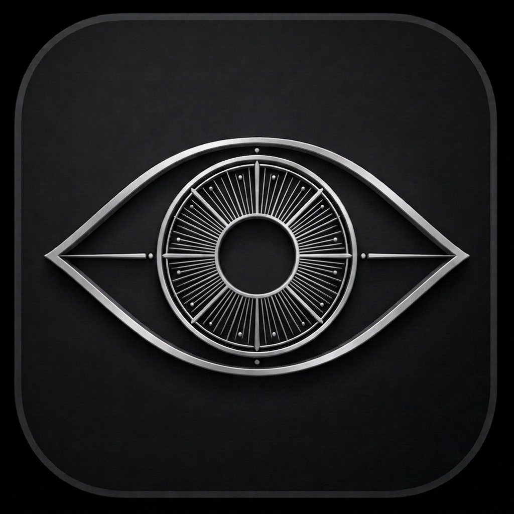
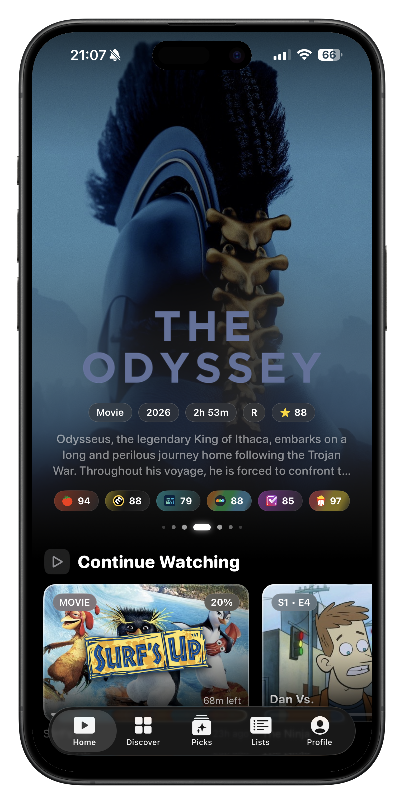
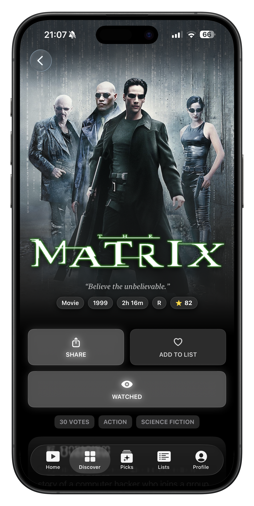
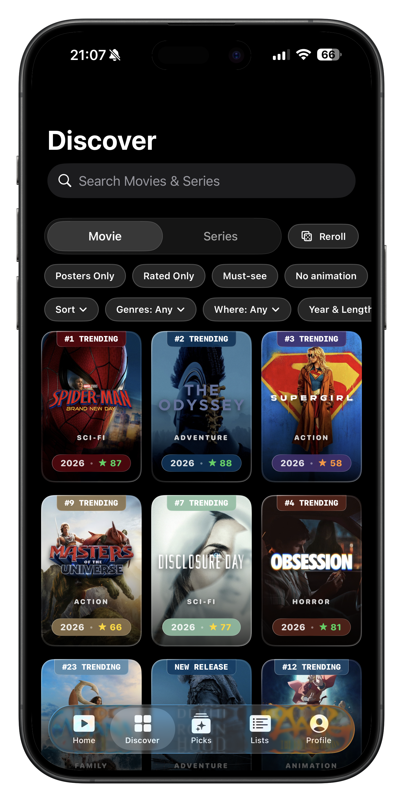
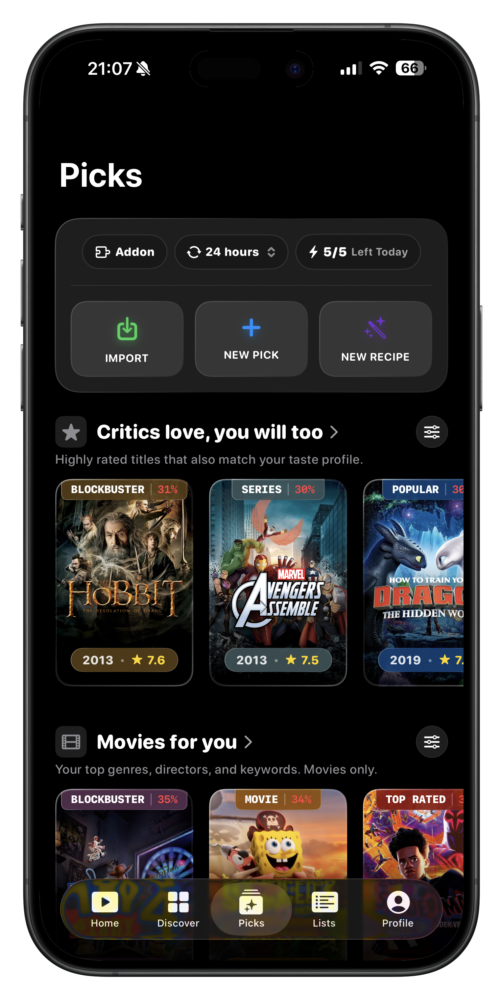
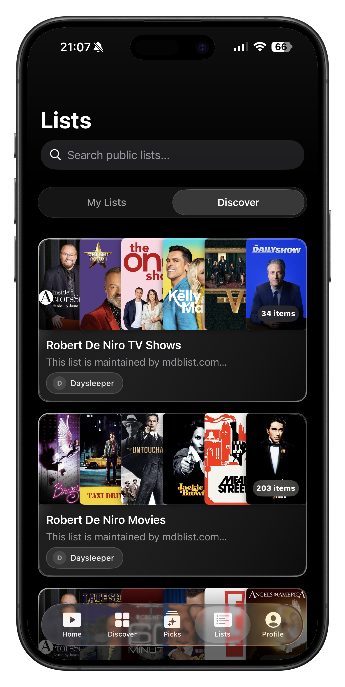
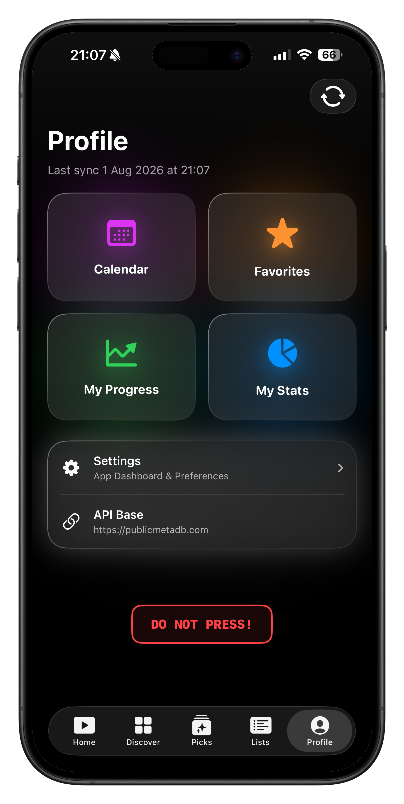

<p align="center">
  
</p>

<h1 align="center">Argus</h1>

<p align="center">
  A free open source, native iOS client for <a href="https://publicmetadb.com">PublicMetaDB</a> — built with SwiftUI and Liquid Glass.
</p>

<p align="center">
  <a href="https://github.com/AncientFalcon88/Argus/releases"></a>
  <a href="LICENSE"></a>
  
  
  
</p>

---

> **v1.0-beta** -- This is first the public release. Some features may be buggy.  
> Please [report issues on GitHub](https://github.com/AncientFalcon88/Argus/issues) or reach out on Discord (see [Contributing](#contributing)).

---

## Screenshots

<p align="center">






</p>


---

## What is Argus?

Argus is a **fully native iOS app** client to [PublicMetaDB.com](https://publicmetadb.com) -- a community-driven database for movies and TV shows. It delivers everything the website has, and more, in a premium native experience built with SwiftUI and Apple's Liquid Glass design language.

Argus is **free and open source** under GPL-3.0.

---

## Why the app instead of the website?

Argus is a fully native iOS experience with a lot of new features:

| Feature | Website | Argus |
|---------|:---:|:-----:|
| All PublicMetaDB features | ✅ | ✅ |
| Liquid Glass design | ❌ | ✅ |
| Hero section trailer auto-play | ❌ | ✅ |
| Episode drops push notifications | ❌ | ✅ |
| Exact episode air times (via built-in TVmaze API) | ❌ | ✅ |
| Convert scales | ❌ | ✅ |
| Custom posters | ❌ | ✅ |
| Alternate app icons | ❌ | ✅ |
| Cinematic share posters | ❌ | ✅ |
| Person detail pages | ❌ | ✅ |
| Extended metadata | ❌ | ✅ |


> Every feature on [PublicMetaDB.com](https://publicmetadb.com) is fully implemented in Argus — ratings, skip timestamps, highlights, ID mappings, lists, picks, community voting, My progress, My stats, and more — all in a native iOS experience.

---

## Requirements

- iOS 26.0+
- iPhone (iPad layout not officially supported yet)
- A free [PublicMetaDB](https://publicmetadb.com) account
- A free [TMDB API key](https://www.themoviedb.org/settings/api)

---

## Installation

### Option 1 -- AltStore / SideStore (Recommended)

To install via AltStore or SideStore, you need to **copy the source URL below** and manually paste it into the "Sources" page of your sideloading app:
```
https://raw.githubusercontent.com/AncientFalcon88/Argus/main/altstore-source.json
```

> **Note:** Free Apple ID sideloading is limited to 3 apps and requires refreshing every 7 days. A paid Apple Developer account removes this restriction.

---

### Option 2 -- Other Sideloading Tools

Download the `.ipa` from the [Releases page](https://github.com/AncientFalcon88/Argus/releases) and sideload it using any tool you like — [Sideloadly](https://sideloadly.io), [Feather](https://github.com/khcrysalis/Feather), [KSign](https://github.com/0xilis/ksign)[](https://github.com/opa334/TrollStore), or any other sideloading tool.

---

### Option 3 -- Build from Source

1. Clone the repo:
   ```bash
   git clone https://github.com/AncientFalcon88/Argus.git
   cd Argus
   ```
2. Open `Argus.xcodeproj` in **Xcode 26+**.
3. Select your target device or simulator.
4. Set a **Development Team** in *Signing & Capabilities*.
5. Build and run (`Cmd+R`).

---

## Setup

On first launch, you must log in with your PublicMetaDB account and provide a TMDB API key on the login screen:

| Requirement | Where to get it | Required? |
|-------------|----------------|-----------|
| **PublicMetaDB Account** | Create a free account at [publicmetadb.com](https://publicmetadb.com) | Required |
| **TMDB API Key** | Get a free API key at [themoviedb.org/settings/api](https://www.themoviedb.org/settings/api) | Required |

Keys are stored securely in the **iOS Keychain** -- never in plain text or iCloud.

---

## Contributing

Contributions are welcome! Reach out on Discord.

> **Discord:** `@ancientfalcon88`

For bugs and feature requests, [open a GitHub Issue](https://github.com/AncientFalcon88/Argus/issues).


## License

Argus is free software, released under the **GNU General Public License v3.0**.

You are free to use, study, modify, and distribute Argus -- but any derivative work **must also be open source under the same GPL-3.0 license**. You cannot make a closed-source version of Argus.

See [`LICENSE`](LICENSE) for the full license text.

